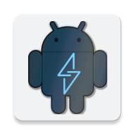

# LinkDroid is an Android App for Linkwarden    

(C) 2023 - 2024 by Daniel Brendel
(C) 2024 - by David Aderbauer

Released under the GPLv3, formerly under the MIT license

This repository is a fork of Daniel Brendels android app for HortusFox (https://github.com/danielbrendel/hortusfox-app-android), adapted for Linkwarden.

## Description
This app is for android mobile phones or tablets in order to comfortably
use the <a href="https://github.com/linkwarden/linkwarden">Linkwarden link storage system</a>.
This way a more native mobile experience should be provided, including a natural sharing of links to upload.

## Installation

or get it directly from the [releases](https://gitlab.com/Dacid99/linkdroid-for-linkwarden/-/releases).

## System requirements
- Android 5.0+
- works best on Android 13+

## Translators wanted!
I'm looking for people to translate the app. Specifically the languages that Linkwarden supports right now would be extremely helpful.
These are:
- Italian (it)
- French (fr)
- Chinese (zh)

If you want to help with that please:
- fork this repository
- add a new directory in app/src/main/res named values-{your language code}
- copy the file app/src/main/res/values/strings.xml to this new directory
- translate the strings in the file
- create a pull request (on github) or merge request (on gitlab) 
- Thankyou for the support! 

# Contributors
A big THANKYOU to everyone who helped with this project!

- [d0dg3r](https://github.com/d0dg3r)