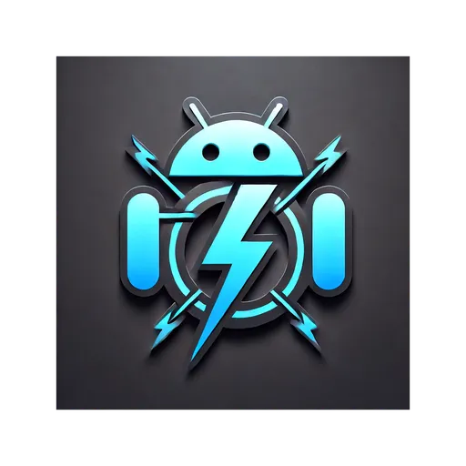

# LinkDroid - Android App for Linkwarden

LinkDroid is a native Android application for the [Linkwarden](https://github.com/linkwarden/linkwarden) link management system, providing a seamless mobile experience for managing your links.

© 2023 - 2024 by Daniel Brendel  
© 2024 - by David Aderbauer  
Released under the GPLv3, formerly under the MIT license

This repository is a fork of Daniel Brendel's Android app for HortusFox (https://github.com/danielbrendel/hortusfox-app-android), adapted for Linkwarden.

## Features

- Native Android interface for Linkwarden
- Easy link sharing and uploading
- Material Design 3 user interface
- Connection testing capability
- Dark mode support
- Responsive design for phones and tablets
- Built-in web view for seamless browsing
- Quick settings access through drawer interface

## Installation

Or get it directly from the [releases](https://gitlab.com/Dacid99/linkdroid-for-linkwarden/-/releases).

## System Requirements

- Android 5.0+ (minimum)
- Android 13+ (recommended for best experience)
- Internet connection for syncing with Linkwarden server

## Configuration

1. Install the app
2. Open the settings drawer
3. Enter your Linkwarden server URL
4. Add your authentication token
5. Test the connection
6. Start using the app!

## Translation Support

We're actively looking for translators to help make LinkDroid accessible in more languages, particularly those already supported by Linkwarden:

- Italian (it)
- French (fr)
- Chinese (zh)

### How to Contribute Translations

1. Fork this repository
2. Create a new directory in `app/src/main/res` named `values-{language-code}`
3. Copy `app/src/main/res/values/strings.xml` to the new directory
4. Translate the strings in the file
5. Submit a pull request (GitHub) or merge request (GitLab)

## Privacy & Security

- No tracking or analytics
- Local-first approach
- Direct connection to your Linkwarden instance
- No third-party services required

## Contributors

A big THANK YOU to everyone who helped with this project!

- Joe Mild 
  
  
  

## Development

This app is built using:
- Native Android development with Java
- Material Design 3 components
- AndroidX libraries
- Modern Android architecture patterns

## License

This project is licensed under the GPLv3 License - see the [LICENSE](LICENSE) file for details.

## Acknowledgments

- Original HortusFox app by Daniel Brendel
- Linkwarden team for the amazing link management system
- All contributors and translators